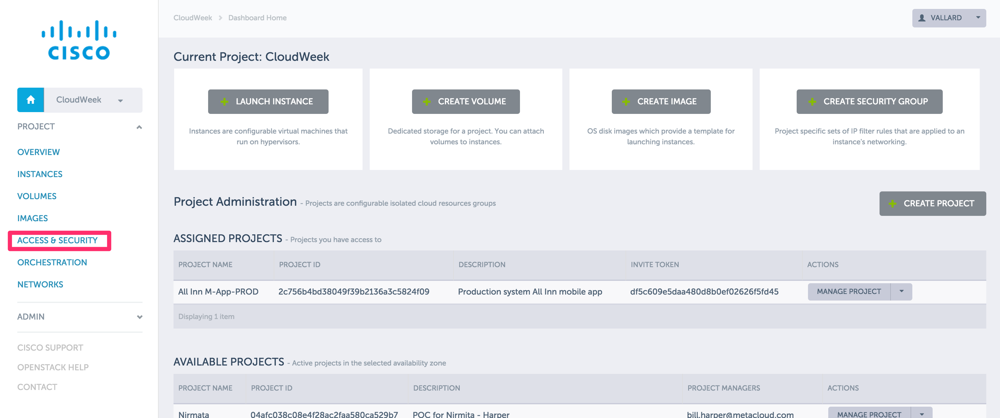
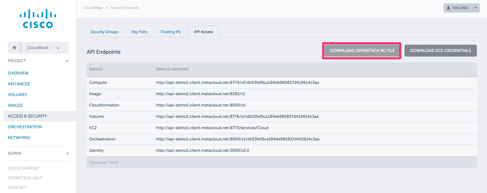

# Module 1: Consuming OpenStack APIs

This module will focus on using OpenStack APIs using various configuration
tools.  When completed, the user will gain an understanding of how to 
communicate with the OpenStack APIs in Metapod.  

## Table of Contents

  * [1\.1 Log into lab work stations](#11-log-into-lab-work-stations)
  * [1\.2 Exercise \- Build Workstation Environment](#12-exercise---build-workstation-environment)
    * [1\.2\.1 Export Environment Variables](#121-export-environment-variables)
  * [1\.3 Exercise  \- Curl: Using raw APIs](#13-exercise----curl-using-raw-apis)
  * [1\.4 Exercise \- Using Python Clients](#14-exercise---using-python-clients)
    * [1\.4\.1 Show the python client libraries\.](#141-show-the-python-client-libraries)
    * [1\.4\.2 Launch a server](#142-launch-a-server)
    * [1\.4\.2\.1 List current servers](#1421-list-current-servers)
    * [1\.4\.3 Show OpenStack flavors](#143-show-openstack-flavors)
    * [1\.4\.4 Show OpenStack Images](#144-show-openstack-images)
    * [1\.4\.5 Generate a Keypair](#145-generate-a-keypair)
    * [1\.4\.6 Create a new instance](#146-create-a-new-instance)
    * [1\.4\.7 Log In to the new Instance](#147-log-in-to-the-new-instance)
  * [1\.5 Creating your own Python Commands](#15-creating-your-own-python-commands)
  * [1\.6 Ansible](#16-ansible)
    * [1\.6\.1 Get Sample Ansible](#161-get-sample-ansible)
    * [1\.6\.1 Edit playbook](#161-edit-playbook)
    * [1\.6\.2 Run the playbook](#162-run-the-playbook)
  * [1\.7 OpenStack Heat](#17-openstack-heat)
    * [1\.7\.1 Edit a sample Heat Template](#171-edit-a-sample-heat-template)
    * [1\.7\.2 Run the heat template](#172-run-the-heat-template)
  * [1\.8 Terraform](#18-terraform)


## 1.1 Log into lab work stations

The instructor will have several IP addresses available for you to log
into.

You will also get a user ID assigned to you. 

You will need to ssh into the lab client on port 2222.  

On a MAC: 
```
ssh -p 2222 userXX@<IP ADDRESS> 
```

The password is ```Cisco.123```

_Note:  You may wish to do some of these exercises on your own laptop.  Setting
up your laptop for development is a very personal decision and not one we will 
cover in these labs. You are welcome and encouraged to try and adapt these instructions 
to your own environment._  

## 1.2 Exercise - Build Workstation Environment

Login to the Metapod horizon dashboard.  This is a URL that should be posted
at the front of the class.  

Click on the __ACCESS AND SECURITY__ 



Navigate to the __API Access__ tab in the workpane and download the Openstack RC file. 



This file contains all the environment variables we need to access the APIs.  Save this 
file then open with a text editor to see what was set. 

### 1.2.1 Export Environment Variables

Edit the ```~/.profile`` file.  This file contains settings that get executed each time
a user logs into the shell. 

When you open the file you will see the skeleton values set below:

```
export OS_AUTH_URL=""
export OS_TENANT_ID=""
export OS_TENANT_NAME=""
export OS_USERNAME=""
export OS_PASSWORD=""
export OS_REGION_NAME="RegionOne"
```

You'll need to modify the variables OS_AUTH_URL, etc and fill in the actual values 
you got from the OpenStack RC file that you downloaded in the previous step. 

_NOTE: Make sure you leave the ```export``` in front of the definition_

Setting these environment variables will allow your other programs to access the 
APIs of the lab for all the excercises.  

You can use ```vi``` or ```nano``` to open the file: 

```
vi ~/.profile
```

[There's a nice 5 minute introduction](http://heather.cs.ucdavis.edu/~matloff/UnixAndC/Editors/ViIntro.html)
to vi that might help if you wish to learn that.  (recommended if you are not!)

__Note:  You should put the Metapod password in there and not $OS_PASSWORD in the environment variables__
Log out and log back in for your environment variables to become active.  
Alternatively, run the command: 

```
. ~/.profile
```

When you log in make sure you see all the environment variables defined: 

```
env | grep OS
```

_NOTE: The OpenStack RC file that you download asks you to enter your password when
you first login to a new shell.  This doesn't work so well in the .profile file. 
So this is really just a matter of style.  You can also chose to simply source the 
OpenStack file you downloaded from Metapod._

## 1.3 Exercise  - Curl: Using raw APIs

The OpenStack APIs return JSON responses to common web requests.  We can use curl to simply
make web calls to the interface.  Let's try running a curl request against the OpenStack
Authentication URL: 

```
curl $OS_AUTH_URL
```

You should receive a bunch of text back in one line similar to the below:

```json
{"version": {"status": "stable", "updated": "2014-04-17T00:00:00Z", "media-types": [{"base": "application/json", "type": "application/vnd.openstack.identity-v2.0+json"}, {"base": "application/xml", "type": "application/vnd.openstack.identity-v2.0+xml"}], "id": "v2.0", "links": [{"href": "http://api-demo1.client.metacloud.net:5000/v2.0/", "rel": "self"}, {"href": "http://docs.openstack.org/api/openstack-identity-service/2.0/content/", "type": "text/html", "rel": "describedby"}, {"href": "http://docs.openstack.org/api/openstack-identity-service/2.0/identity-dev-guide-2.0.pdf", "type": "application/pdf", "rel": "describedby"}]}}
```

This return format is called JSON.  
JSON = Javascript Object Notation.  JSON is great because its compact and easy to learn

[Learn more about JSON in this five minute official introduction.](http://www.json.org/)

_Note:  If you get something that looks like an error please check that your environment 
variables are set up correctly by going through section 1.2._

It is also nice to 'pipe' the output of this command to a json formatting
tool.  Python has one called json.tool.  Call the previous command again
as follows: 
```
curl $OS_AUTH_URL | python -m json.tool
```

This gives you something a little more readable.  

You can also request a token to do other openstack commands using: 

```
curl -d '{"auth":{"passwordCredentials":{"username": "'"$OS_USERNAME"'", "password": "'"$OS_PASSWORD"'" }}}' \
-H "Content-type: application/json" -X POST $OS_AUTH_URL/tokens | python -m json.tool
```
_Note the double quotes around the OS variables.  This is to ensure these variables are passed to the curl command._

The ```python -m json.tool``` at the end will format it nicely.  


## 1.4 Exercise - Using Python Clients

OpenStack has python client libraries that can be installed to make managing your cloud via
the command line a convenient way to execute common tasks.  

### 1.4.1 Show the python client libraries.

Run the command below:
```
pip list
```

This gives you a list of python packages (libraries) that are installed on the system.  

Pip is a python packaging tool that allows for simple downloading of python libraries.  You'll see
that several OpenStack python clients have been installed.  The client names correspond to the 
project.  

```
python-cinderclient (1.4.0)
python-heatclient (0.7.0)
python-keystoneclient (1.7.1)
python-novaclient (2.29.0)
python-swiftclient (2.6.0)
```    

If you had ```sudo``` access you would be able to install other python libraries by running the 
```pip install``` command. 

### 1.4.2 Launch a server

Now that you see several OpenStack python client libraries are installed we can use these libraries
to launch an instance.  

In cloud computing we typically call 'vms' 'instances' to denote their ephemeral nature. 

Let's start by listing the existing servers that are currently running in your project. 
This can be done by running the below command:

```
nova list
```

These are the currently running servers.  Nova is the OpenStack Compute project so actions that
require operations on instances are usually performed using nova.  

Take note of the names.  When we create a new server, we don't want to duplicate a name that is
already there!  OpenStack allows this, but this creates confusion!

### 1.4.3 Show OpenStack flavors

A flavor is an abstraction that describes the virtual hardware of what an instance looks like. 
For example, a flavor details: 

* The number of vCPUs
* The amount of RAM
* Available disk

Run the command: 

```
nova flavor-list
```

This will show the different flavors availabe in the system.  In Metapod the administrators have
the ability to create different flavors.  For example, a project may require a flavor that uses
all the resources of a physical machine for using Apache Spark with HDFS.  

Take note of the m1.small ID.  This may be 3 or something else.  We can get more information on this

```
nova flavor-show 3
```

alternatively you can run: 
```
nova flavor-show m1.small
```

and get the same results. 

OpenStack tries to stick with the CRUD model, so for most subcommands there is a ```-show```, ```-delete```
, and ```-list``` command. 

What is[CRUD](https://en.wikipedia.org/wiki/Create,_read,_update_and_delete)?

### 1.4.4 Show OpenStack Images

```
nova image-list
```
or 
```
glance image-list
```

You should see lots of images!  Cisco Metapod comes with many already predefined for you.  Most 
environments will make their own.  

Find the ubuntu image ```ubuntu.12-04.x86-64.20130725``` as this is what we'll use.  


### 1.4.5 Generate a Keypair

In order to log into an instance that we will create we need to make a keypair.  The Keypair 
consists of a public and private key.  The public key will be installed on the instance when 
it is launched and the private key we will download and use to log into the instance.  

Run the command: 
```
nova keypair-add <name>key | tee <name>key.pem
chmod 600 <name>key.pem
```
Where ```<name>``` is your name, or some amazingly distinguished unique name that you will know is
yours.  

This command will generate the output of the private key. The ```tee``` command is a shell
command that will pipe the key output to a file called ```<name>key.pem```.

Running the command 

```
nova keypair-list
```

will show you all the keys in your system.  If you made a mistake, you can delete the key you made and run the command again.  
```
nova keypair-delete <name>key
```

_Note that if you lose the private key, you will never be able to log into your instances again.  It can not
be recovered.  So make sure you save it the first time!  If you lose it, delete the keypair and use one you know!_
### 1.4.6 Create a new instance

Run the following command to create a new instance

```
nova boot --flavor m1.small --image ubuntu.12-04.x86-64.20130725 --key-name <name>key <name>firstimage
```

Where ```<name>``` is your fun unique name.  

Check on the status to see if the server has been created using the ```nova list``` and 
```nova show <name>firstimage``` commands.

### 1.4.7 Log In to the new Instance

To make sure you did it right, log into the new instance you just created:
```
ssh -i <name>key.pem cloud@<name>firstimage
```
where ```<name>``` is once again the unique name you picked. 

If all is successful you should be able to login with out a password: 
```
$ ssh -i chomp.pem <user>@chomp
Welcome to Ubuntu ....

 * Documentation:  https://help.ubuntu.com/

   System information as of Tue Sep 15 19:41:25 UTC 2015

   System load: 0.0               Memory usage: 1%   Processes:       76
   Usage of /:  56.9% of 1.32GB   Swap usage:   0%   Users logged in: 0

   Graph this data and manage this system at:
       https://landscape.canonical.com/

   Get cloud support with Ubuntu Advantage Cloud Guest:
       http://www.ubuntu.com/business/services/cloud

0 packages can be updated.
0 updates are security updates.

...
Ubuntu comes with ABSOLUTELY NO WARRANTY, to the extent permitted by
applicable law.

<user>@chomp:~$ 
```

This concludes Exercise 1.4.  You have created an instance using the 
command line. Everything you have done so far could also be done on 
the Horizon dashboard that Metapod provides.  

There are other clients that you can experiment with if you have time
including the cinder and keystone clients.


## 1.5 Creating your own Python Commands

__Be sure to log out of the instance you just created so as not to confuse
which server you are working on for the rest of the sections!__

The python client contain libraries that can also be used by our own
python code that we write.  To illustrate this, we'll show some code 
that uses it.  

We'll use [this sample application](https://github.com/vallard/COPC-API-Examples/blob/master/02-Python/sample-python-get.py).
Open your web browser and have a 
look.  


On the workstation, download a sample python application: 

```
wget https://raw.githubusercontent.com/vallard/COPC-API-Examples/master/02-Python/sample-python-get.py
chmod 0755 sample-python-get.py
```

You can then run the command by executing: 

```
./sample-python-get.py
```
You will see a bunch of output flow by!  All the application is doing is running a few list commands and putting
them into variables and using them. There may be errors in the code.  Bonus points if you can
fix it!

## 1.6 Ansible

Eventually as you start making your own scripts to manage fleets of Virtual machines
you will create a framework of scripts to manage the environment.  This framework
unless radically different than what is already available is called 'Reinventing
the Wheel'.  Its fun, but can become cumbersome.  Instead a better idea would be
to explore a different framework.  

Ansible is great framework to start with.  

Currently Ansible is stuck somewhere version 1.9 and 2.0.  2.0 has a lot of OpenStack
goodness to it, but is pretty buggy if your environment isn't setup for later 
distributions. 

Ansible has the idea of 'playbooks'.  These are just run scripts that we use to
run common tasks like install a package or provision an instance.  

### 1.6.1 Get Sample Ansible

Ansible is already set up on the workstation.  Ansible is a framework for running
automated workflows on a system.  Ansible does this with the concept of 
_playbooks_.  A playbook is a set of scripts or actions that should be executed on 
a host.  The _playbooks_ are designed to be idempodent.  Meaning that it declares the
state it wants the system to be in.  When the playbook is run, if the system is not in
that state, the actions are run.  If the system is already in a good state, it will leave
it alone.  This means that you can always safely run the playbooks without fear of taking
the system down.  

Let's download some playbooks that
are mostly written that we can use.  On your lab machine run the command: 

```
cd ~/
git clone https://github.com/vallard/COPC-API-Examples.git
```

This will clone several examples that we may use later on. 

### 1.6.1 Edit playbook

Change to the directory where Ansible scripts are laid out for you.  

```
cd ~/COPC-API-Examples/03-Ansible/
```

Here you will find a playbook called copc-one.yml.  Open this file 
and we will edit it. 

* Enter an image ID.  You may need to run ```nova image-list``` to access one. Note, make
sure this is the image ID and not the image name. 
* Enter your key name.  This is the key name you used in a previous exercise. 
* Change the ```name``` from ```ansible-server``` to something unique. 
* Change the ```flavor_id``` to be the m1.small ID that you can get by running ```nova flavor-list```.  This will be a long string like ```6976591b-8b4c-40f1-9e2f-d69f68de0015```

Notice that the script will also use environment variables.  In Ansible
2.0 these are not required and picked up automatically with the new
[shade library.](http://docs.openstack.org/infra/shade/)

### 1.6.2 Run the playbook

We can run the playbook to create a new OpenStack image by running: 

```
ansible-playbook copc-one.yml
```

Log into the dashboard or run ```nova list``` to make sure that the
instance is up.  

## 1.7 OpenStack Heat

OpenStack Heat is another way to declaritively initialize an environment. 
There is overlap with what you can do with Ansible.  Perhaps the best 
reason to use Heat is that its native to the OpenStack environment and
can be called from other OpenStack projects to autoscale environments.  

### 1.7.1 Edit a sample Heat Template

On your workstation, you cloned a repository with git previously.  Let's 
look at the file and edit it right now. 

```
cd ~/COPC-API-Examples/04-Heat/
```
Modify the ```heat-wget.yml``` file.  

* Make sure the image name actually exists on the system.  Use 
```glance image-list``` to verify
* Make sure your keypair is there. 
* Modify the image name to be an image name that actually exists on the system. 

Save the changes and close the file. 

### 1.7.2 Run the heat template

You can now run the Heat stack by running: 
```
heat stack-create mytest<user id> --template-file ./heat-wget.yml
```
The output will look similar to: 
```
+--------------------------------------+------------+--------------------+----------------------+
| id                                   | stack_name | stack_status       | creation_time        |
+--------------------------------------+------------+--------------------+----------------------+
| 4b55cc3a-03b7-49e6-9ecb-69862fe237a3 | mytest06     | CREATE_IN_PROGRESS | 2015-09-15T23:42:07Z |
+--------------------------------------+------------+--------------------+----------------------+
```

Running ```nova list``` will show the instance that it created.  The name
will be mytest<id> followed by some random characters.  In
this example we've only done a small amount of what Heat can do.  It 
can also create volumes and assign floating IP addresses.  

We can see all of our heat templates by running: 

```
heat stack-list
```
More information on Heat Stacks is available from the 
[OpenStack Website.](http://docs.openstack.org/havana/install-guide/install/apt/content/heat-stack-create.html)

# 1.8 Terraform

Terraform is another tool like Heat that declaratively creates infrastructure as code. 
Unlike OpenStack Heat, it works across different environments such as GCE, AWS, and 
several more.  

```
cd ~/COPC-API-Examples/05-Terraform/
```
Modify the ```example.tf``` file.

* Change the username to cloudweek
* Update name, image_id, flavor_id and keypair

Test with the command ```terraform plan```

Instanciate the server with the command ```terraform apply```

Verify with the command ```nova list```


