# Module 3: Continous Integration
[Home](https://github.com/vallard/CiscoCloudDayLab1)

The first two modules got us working with APIs, Git, and Docker.  In this module
we will tie all of it together with some helpful bots.  In this case
our bot will be [Jenkins](https://jenkins-ci.org).  

We're going to create a fun website.  This website will be front-ended with a
load balancer that will then direct traffic to some of our instances.  

When ever we push new code, our robot will take the code out of gitlab run
some tests, and then push the new code into production.  

## 3.1 Configure Gitlab

Create a new account on Gitlab.  __Please do not go to gitlab.com__ The instructor will give you the URL
of where to sign in to create this account.  The account name can be
anything you like (your name, CEC, etc). 

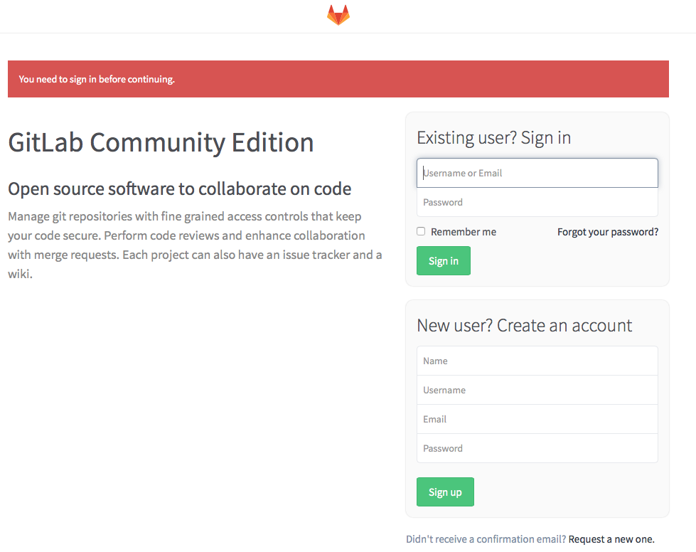

Enter a random password.  Let the administrator know that you have created
the account.  They will then confirm your account so that you can login
without having to check your email.  

Once they have notified you that your account has been confirmed, log into
gitlab.  

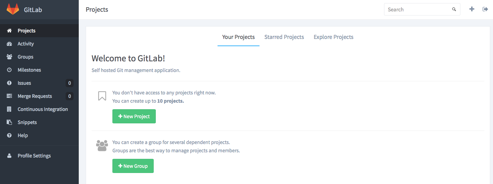

### 3.1.1 Initial project creation

After logging in you will create a new project so that you can upload code
to this source control repository. 

Create a new project by clicking the green _New Project_ button. Call it _web_


You can leave all the default settings and give it a brief description. 

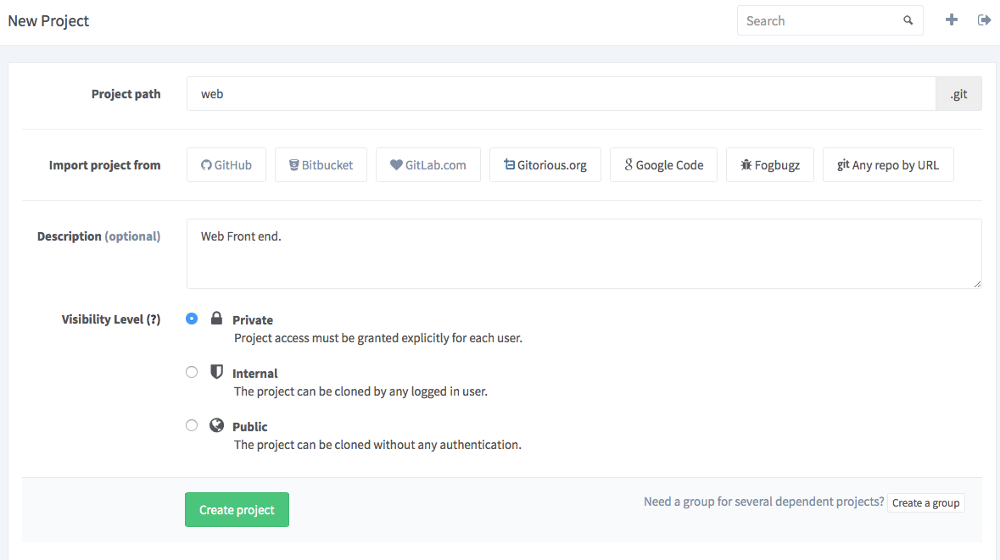

Once this is created, you'll get an error message that shows you that you
can't push or pull code because you haven't entered any SSH keys.  

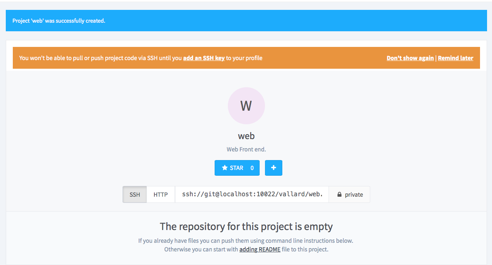

### 3.1.2 Setup SSH keys

On the left menu, click __Back to Dashboard__ and then click __Profile Settings__ 

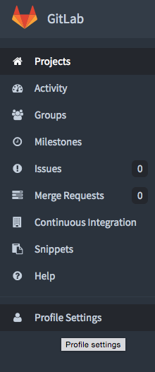

The side menu changes and you should see the _SSH Keys_ menu item in the 
sidebar.  Click on it. 

Click the green button to add an SSH key. We'll come back to this screen
after completing the next step. 

#### 3.1.2.1 Generate SSH key

Log back into the lab machine and generate a new SSH key to be used by 
this lab user. Run the command:

```
ssh-keygen -t rsa
```
and just hit the 'enter' button at all the questions.  

This will create two keys inside your ```~/.ssh``` directory.  One key is
the public key ```id_rsa.pub``` and the other key ```id_rsa``` is your 
private key.  We are going to paste the contents of the ```id_rsa.pub```
key to the Gitlab web page we have open now. 

```
cat ~/.ssh/id_rsa.pub
... < your key >
```
Copy and paste this into the browser.  

#### 3.1.2.2 Install SSH key into Gitlab

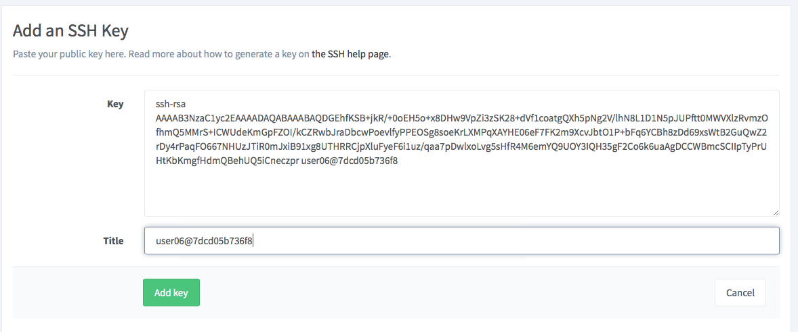

Clicking 'Add Key' should save the key into your account.

## 3.1.3 Clone Repository

* From the left side menu select _Back to dashboard_

* From the projects menu select your _web_ project.  You will then be taken
to a page that has information on how to start up the project.  

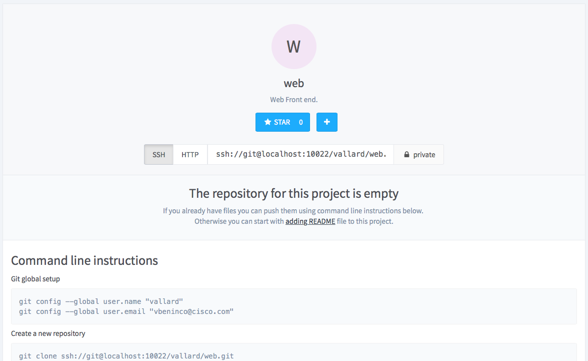

At this point we are going to take a public repository that already has
code and copy it into our newly created private repo.  This is done by
executing the following commands back on your lab workstation: 

```
git clone https://github.com/vallard/go-webapp.git
cd go-webapp
```
Now we want to change the remote origin from Github to our local Gitlab
account.  To do this, we first configure some global settings: 
```
git config --global user.name "<gitlab username>"
git config --global user.email "<gitlab email>"
```
Where ```<gitlab username>``` is the user name you signed into Gitlab with. 

Now, we will remove the Github origin
```
git remote remove origin
```
Then we will add the Gitlab origin and commit the code up:
```
git remote add origin ssh://git@ci:10022/<gitlab user name>/web.git
git add . 
git push -u origin master
```
Now go back to the Gitlab page and refresh the page. You should see some of the new content! 
You just pushed code into Gitlab. 

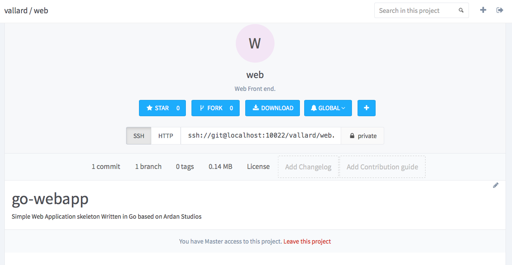

You'll notice our gitlab is configured to show ```localhost```.  For access
from our lab workstations we can simply replace ```localhost``` with ```ci```

Now that we have our application into Gitlab and we can commit and pull
changes. 

### 3.1.4 Add Jenkins User

Since your project is private, only people you give permission can access your 
code.  We want our robot (jenkins) to be able to access this code to perform testing
on it when there are code changes.  

The jenkins gitlab user was created previously for you.  This is a user with his own
keys that allow him to authenticate into the system. We now need to grant this user
access to our project.  

* From the Project dashboard, select your project.  
* Select _Members_ from the sidebar. 
* Select _Add Members_ from the green button and add the Jenkins user. 

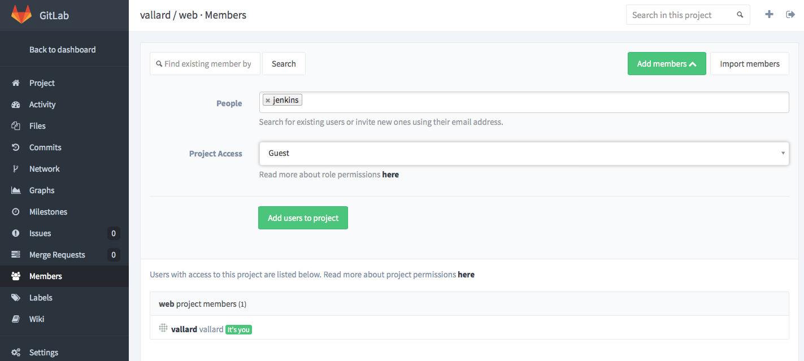

## 3.2 Configure Jenkins

Now that our project is up and ready we need to tell Jenkins what to do on changes.  

Sign into Jenkins using the URL that your instructor gives you. 

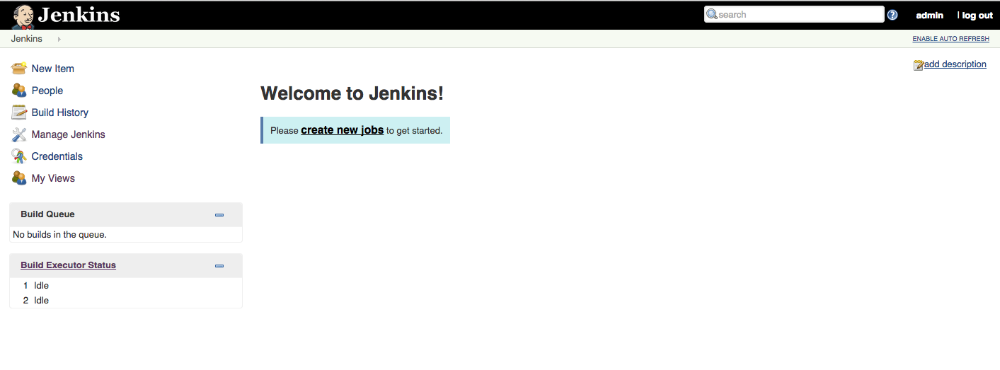

* Click on _create new jobs_ or add a new job from the left side pane by selecting _New Item_.  Give the job a name of your choice.  This can 
be your name or user ID. 

* The job type should be _Freestyle project_

* Click _OK_ 

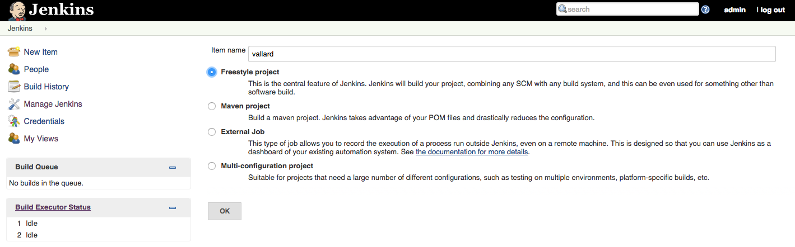


### 3.2.1 Configure Git information

* Select the button __Restrict where this project can be run__ for the lable expression select
_coreos-slave_. 

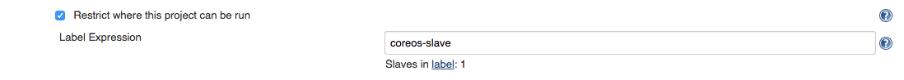

* Under _Source Code Management_ select _Git_ and fill in the repository information
  * Repository URL: ```ssh://git@ci:10022/<yourname>/web.git``` where ```<yourname>``` is your user id. 
  * Credentials: There should be a jenkins credentials to select from. 
 
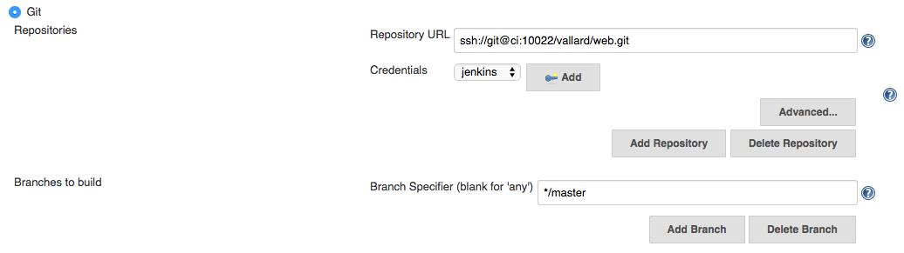

* Under _Build Triggers_ select _Build when a change is pushed to GitLab. And select the sub topics to be selected too. 

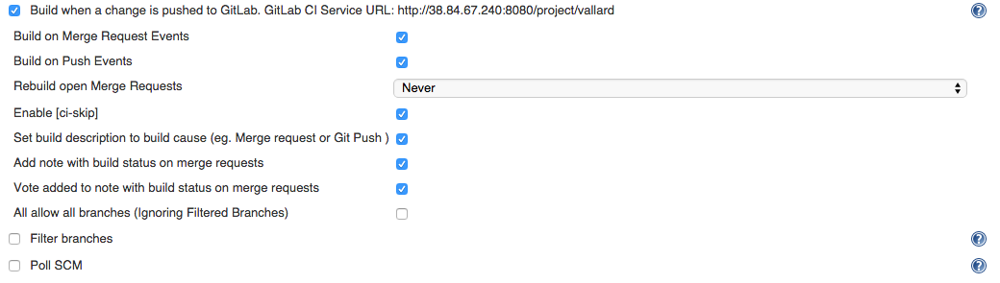

### 3.2.2 Configure Build Environment

* Select OpenStack Instance Creation and select the only available Cloud Name as well as the only selectable Template from the list. Specify the number of Instances to be 1. 

* Select OpenStack Single-Use Slave

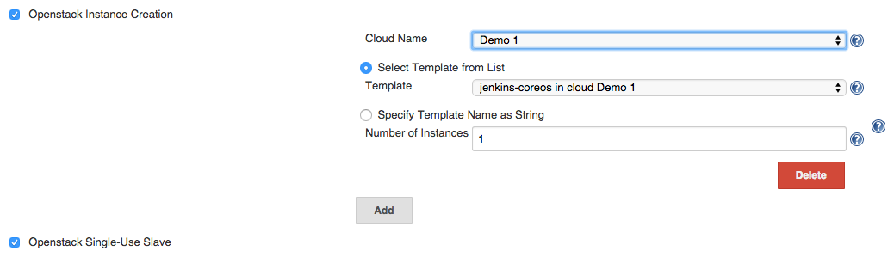

### 3.2.3 Configure Build Rules

The bot is now ready to grab code from Git when it is updated and put it on a slave (create a new Metapod instance).  Now when it puts it on the new instance, we have to tell the bot what to do. 

This part will be different for different workloads that we have.  The most useful will be to run a suite of tests against the newly minted code.  Testing languages differ depending on which language you are using.  

To start things off, just to make sure we have a working environment, let's just execute a simple shell command.  

Select _Add build step_ and select _Execute shell_ from the list of options.  We're just going to run a simple ```ls -l``` command at the prompt to see if it works.  

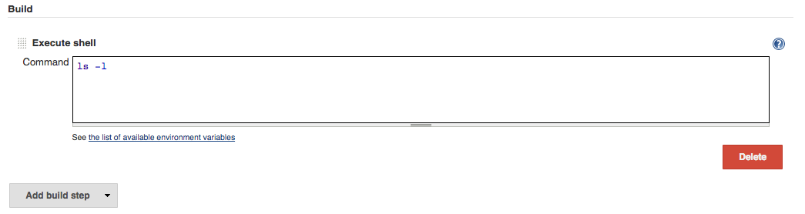

Save your changes below with the blue button. 

### 3.2.4 Slack Integration

We'd like our robot to speak to our chat integration.  You don't have to sign up for Slack but we will use slack 
for this lab.  The reason we use slack instead of Cisco Spark is because Cisco Spark has no integration into Jenkins. 

Under the Slack Notifications, check all the boxes: 

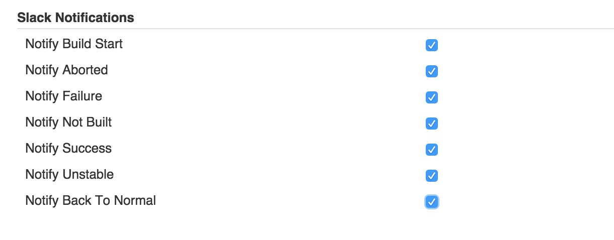

If you want to do more with Slack, let the instructor know.  The reason for this step is so we can see all the commits and builds.

### 3.2.5 Trigger web hooks

* Back in Gitlab click on your project and project settings. 
* Click on Webhooks
* Create a new Webhook. 
* URL: ```http://ci:8080/project/<yourprojectname> ```
* disable SSL verification

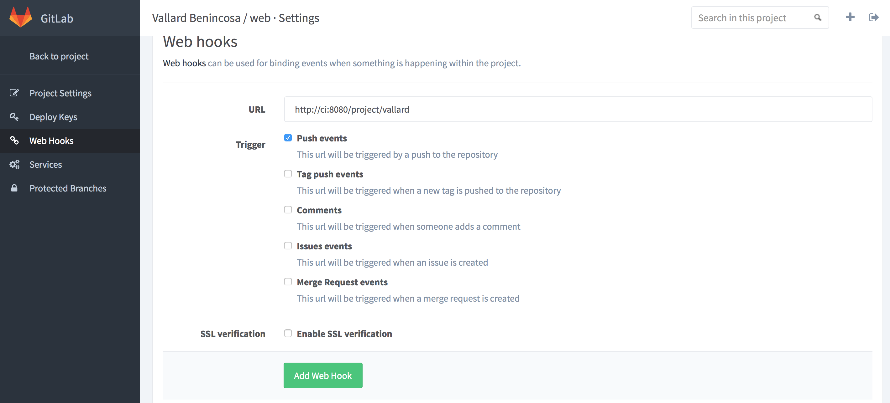

Test the web hook.  It should build in Jenkins!


## 3.3 Test that our CI works. 

Let's test that our tests actually work!  

* Go to your workstation and change into the working directory of the code.  Make a change to the ```README.md``` file by adding a line or deleting a line.  Save the changes and exit the file.  

* Commit the changes and push them up to GitLab

```
git commit -am "I made a change"
git push
```

* Check the Jenkins screen and the Metapod screen to see that a new instance is created.  It may take a few seconds for Jenkins to start processing the build. 

 
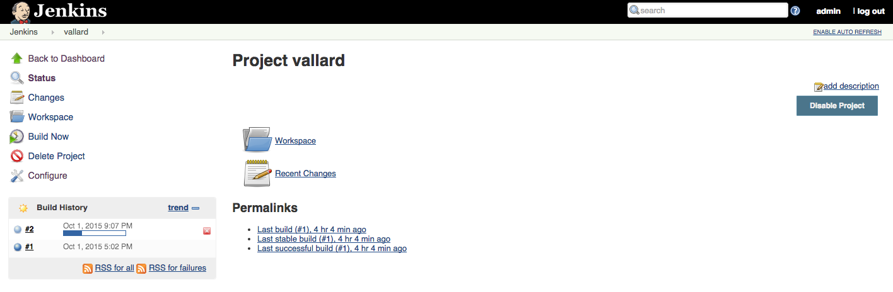

* Once the build begins and the new instance is created, you can view the console output by selecting the build. 

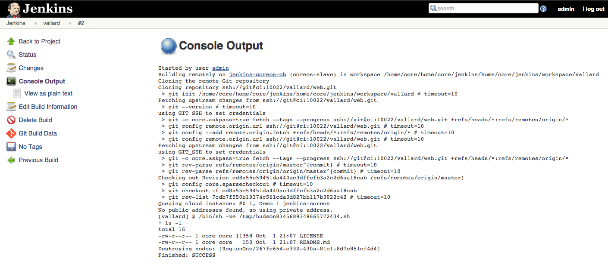

## 3.4 Conclusion

If your build we successful, congratulations!  You just set up the infrastructure for continuous integration.  Everytime the code is checked in, the bot takes it and runs specified tests against it. 


